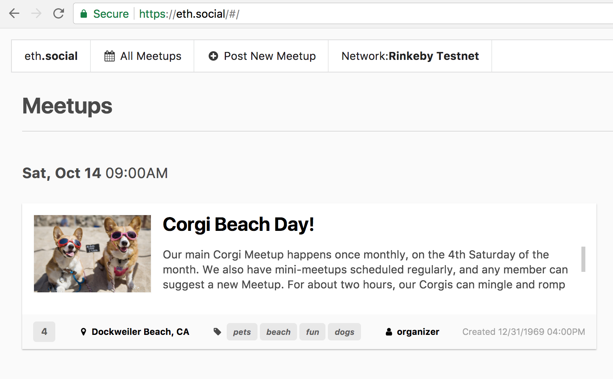
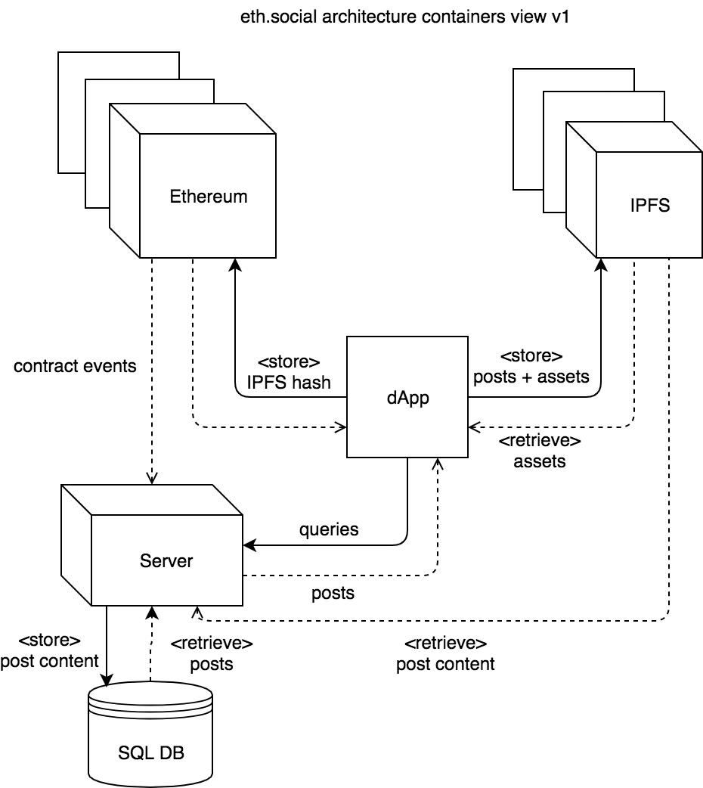

# eth.social

> An Ethereum dApp for posting social events and meetups.



On Rinkeby testnet.

# Demo

**[https://eth.social](https://eth.social)**

# Architecture



# Development

Start testrpc client

```bash
npm run testrpc
```

Watch and compile client

```bash
cd client/

npm run watch
```

Run client server

```bash
cd client/

npm run browser
```

Run server

```bash
cd server/

npm start
```

# Deployment

Compile smart contracts

```bash
truffle compile
```

Deploy smart contracts

```bash
truffle migrate --reset --network=development
```

Deploy client to IPFS

```bash
cd client/
npm run ipfs-deploy
```

# Test

Test smart contracts

```bash
truffle test
```

# License

MIT
