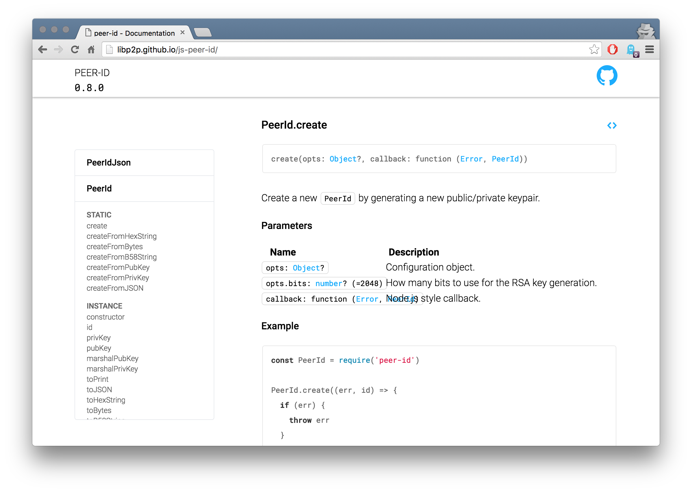

# Clean Documentation Theme

[](http://ipn.io)
[](http://webchat.freenode.net/?channels=%23ipfs)
[](https://travis-ci.org/dignifiedquire/clean-documentation-theme) [](https://coveralls.io/github/dignifiedquire/clean-documentation-theme?branch=master)
[](https://david-dm.org/dignifiedquire/clean-documentation-theme)
[](https://github.com/feross/standard)


> A theme for [documentationjs](https://github.com/documentationjs)



## Preview

- http://libp2p.github.io/js-peer-id/


It uses [React](https://facebook.github.io/react/) server side rendering with [Radium](https://github.com/FormidableLabs/radium/) for styling components.

## Usage

```bash
$ npm install --save-dev clean-documentation-theme
$ npm install --save-dev documentation
```

Add to your `package.json`

```json
"scripts": {
  "docs": "documentation build --format html --theme node_modules/clean-documentation-theme --o docs
"
  ...
}
```

and run

```
$ npm run docs
```

## License

MIT
